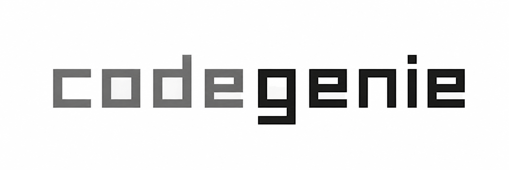
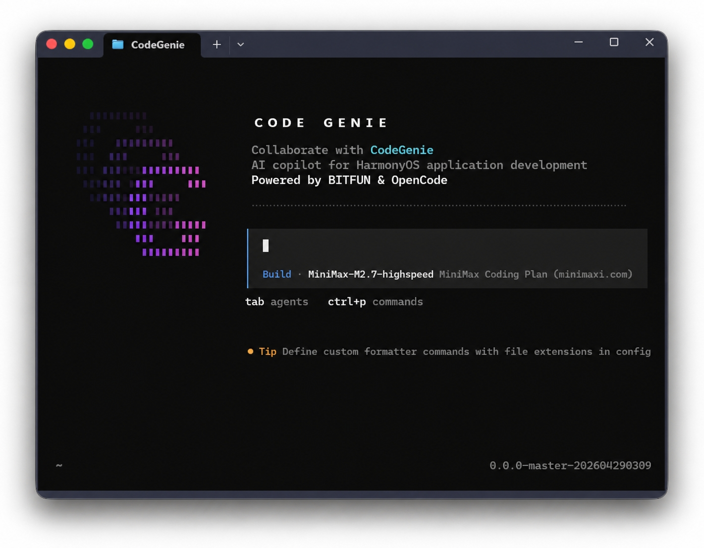

<p align="center">
  <a href="https://www.npmjs.com/package/@codegenie-ai/codegenie-cli">
    
  </a>
</p>
<p align="center">An AI CLI assistant for HarmonyOS application development.</p>
<p align="center">
  <a href="https://www.npmjs.com/package/@codegenie-ai/codegenie-cli"></a>
  <a href="https://developer.huawei.com/consumer/cn/deveco-studio/"></a>
  <a href="https://opencode.ai"></a>
</p>

<p align="center">
  <a href="README.md">English</a> |
  <a href="README.zh.md">简体中文</a>
</p>

[](https://www.npmjs.com/package/@codegenie-ai/codegenie-cli)

---

### Introduction

CodeGenie CLI is an AI CLI assistant for HarmonyOS application development. It supports coding, build and compile workflows, device runs, documentation lookup, runtime debugging, and ArkTS issue fixing.

CodeGenie is built on top of the open source project [OpenCode](https://opencode.ai). It keeps OpenCode's terminal experience, configuration system, Provider / MCP / Skill / Plugin capabilities, and adds HarmonyOS-focused integrations for DevEco Studio, hvigorw, hdc, ArkTS checks, and device debugging.

### Installation

#### System Requirements

| Platform | Support |
| --- | --- |
| Windows x64 | Supported |
| macOS Apple Silicon | Supported |
| macOS Intel x64 | Supported |

#### Prerequisites

CodeGenie is distributed through npm. Install [Node.js LTS](https://nodejs.org) first, then verify your environment:

```bash
node -v
npm -v
```

To use HarmonyOS build, run, and debugging features, install [DevEco Studio](https://developer.huawei.com/consumer/cn/deveco-studio/) and configure `DEVECO_HOME` to point to the DevEco Studio installation directory.

#### Install / Update / Uninstall

```bash
# Install
npm install -g @codegenie-ai/codegenie-cli --registry=https://registry.npmjs.org

# Check version
codegenie --version

# Start
codegenie

# Update
codegenie upgrade

# Remove runtime data
codegenie uninstall

# Remove the npm global package
npm uninstall -g @codegenie-ai/codegenie-cli
```

> [!TIP]
> On macOS, if global installation fails because of permissions, try `sudo -i npm install -g @codegenie-ai/codegenie-cli --registry=https://registry.npmjs.org`.

### Login And Models

After starting `codegenie`, you can log in with a Huawei account. After login, you can use CodeGenie's free model channel. Without login, you can still use OpenCode's Provider configuration system and configure your own models.

```bash
# Log out
codegenie auth logout
```

Type `/models` in CodeGenie to open the model configuration UI. CodeGenie currently provides `glm-5` and `deepseek-v3.2` for free, with a default limit of 50 requests per minute per account. You can also press `Ctrl+A` to enter the Provider selection UI and configure Zhipu, Alibaba, or other OpenAI-compatible models.

You can also configure models through `codegenie.jsonc`:

```jsonc
{
  "$schema": "https://opencode.ai/config.json",
  "provider": {
    "codegenie": {
      "name": "CodeGenie",
      "models": {
        "glm-5": {
          "tool_call": true,
          "limit": {
            "context": 200000,
            "output": 8192
          }
        }
      },
      "options": {
        "baseURL": "https://api.openbitfun.com/v1",
        "apiKey": "{env:CODEGENIE_API_KEY}"
      }
    }
  }
}
```

Configuration priority:

1. `.codegenie/codegenie.jsonc` in the project directory
2. `codegenie.jsonc` in the project directory
3. `.config/codegenie/codegenie.jsonc` in the user directory

### Agents

CodeGenie provides the following Agent modes for HarmonyOS development:

- **build** - Default mode for project generation, code generation, configuration fixes, test execution, package deployment, app runs, and release execution.
- **plan** - For requirement breakdown, technical plans, release planning, test planning, and documentation generation.

Also included is a **general** subagent for complex searches and multistep tasks. It is used internally and can also be invoked with `@general` in messages.

### HarmonyOS Capabilities

CodeGenie integrates common HarmonyOS development tools:

| Tool | Description |
| --- | --- |
| `build_project` | Build the project and export build artifacts |
| `start_app` | Run the app on an emulator or physical device |
| `runtime-calibration` | UI automation testing, available through settings |
| `runtime-calibration_getLog` | Fetch device runtime logs, available through settings |
| `execute_uitest` | UI test actions, including click, swipe, input, key press, and screenshot |
| `hdc_log` | Collect or clear device logs |
| `check_ets_files` | Static syntax checks for ArkTS |

Common scenarios include creating a HarmonyOS project from scratch, incremental page development, fixing build errors, physical device debugging, and generating UI code from images with multimodal models.

### Extensions

CodeGenie is compatible with OpenCode's Skill, MCP, and Plugin extension mechanisms.

#### Skills

```bash
# Install community skills
npx skills add vercel-labs/agent-skills
```

You can also place Skills under `~/.config/codegenie/skills` and restart CodeGenie to load them.

#### MCP

Configure MCP in `~/.config/codegenie/codegenie.jsonc`:

```jsonc
{
  "$schema": "https://opencode.ai/config.json",
  "mcp": {
    "playwright": {
      "type": "local",
      "command": ["npx", "@playwright/mcp@latest"],
      "enabled": true
    }
  }
}
```

#### Plugins

```bash
npm install -g oh-my-opencode
```

Then configure the plugin entry in `codegenie.jsonc`:

```jsonc
{
  "plugin": [
    "file:///C:/Users/tylor/AppData/Roaming/npm/node_modules/oh-my-opencode/dist/index.js"
  ]
}
```

### Migrating From OpenCode

To migrate from OpenCode to CodeGenie, move your configuration files to the CodeGenie directory. For the main configuration file:

```powershell
# Windows PowerShell
Copy-Item -Force "{source path}\opencode.jsonc" "~\.config\codegenie\codegenie.jsonc"
```

```bash
# macOS
cp {source path}/opencode.jsonc ~/.config/codegenie/codegenie.jsonc
```

Skills, Agents, and Plugins can also be migrated to their corresponding directories under `~/.config/codegenie`. MCP configuration can be migrated into `codegenie.jsonc`.

### FAQ

#### What is the relationship between CodeGenie and OpenCode?

CodeGenie is built on top of OpenCode. It keeps OpenCode's terminal UI, Provider, MCP, Skill, Plugin, and configuration system, and adds HarmonyOS-specific capabilities for build workflows, device runs, log collection, ArkTS checks, and runtime debugging.
