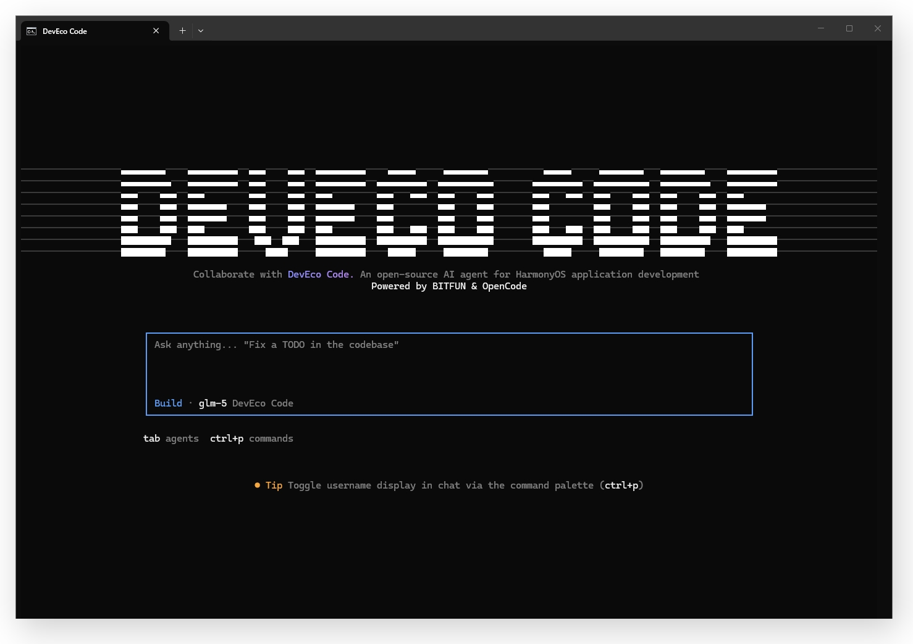

<p align="center">
  <h1 align="center">DevEco Code</h1>
</p>
<p align="center">面向 HarmonyOS（鸿蒙）开发场景的 AI Agent 工具。</p>
<p align="center">
  <a href="https://www.npmjs.com/package/@deveco/deveco-code"></a>
  <a href="https://gitcode.com/openharmony-sig/deveco-code/blob/main/LICENSE"></a>
  <a href="https://gitcode.com/openharmony-sig/deveco-code"></a>
</p>
<p align="center">
  <a href="README_EN.md">English</a> |
  <a href="https://www.npmjs.com/package/@deveco/deveco-code">npm 包页面</a> |
  <a href="https://gitcode.com/openharmony-sig/deveco-code">GitCode 仓库</a> |
  <a href="https://opencode.ai">OpenCode</a>
</p>

<p align="center">
  
</p>

***

## 快速开始

```bash
# 1. 安装
npm install -g @deveco/deveco-code

# 2. 启动
deveco

# 3. 开始对话 —— 在终端中直接描述你的鸿蒙开发需求
提示词示例：
- 解释一下代码库的架构
- 帮我重构login_check这个函数
- 帮我检查并修复语法错误
```

> 如需编译构建、设备运行等能力，请先安装 [DevEco Studio](https://developer.huawei.com/consumer/cn/deveco-studio/) 并配置 `DEVECO_HOME` 环境变量。

## 简介

DevEco Code 是一款面向 HarmonyOS 开发场景的 AI Agent 工具，支持代码编写、编译构建、设备运行、文档查阅、运行时调试及 ArkTS 问题修复等能力。

DevEco Code 基于开源项目 OpenCode 扩展开发，保留了 OpenCode 的终端交互、配置体系、 Provider / MCP / Skill / Plugin 等能力，并针对鸿蒙工程增加了 DevEco Studio、Hvigor、HDC、ArkTS 检查和设备调试相关集成。

## 支持平台

- Windows x64
- macOS Apple Silicon
- macOS Intel x64

## 安装前置

DevEco Code 通过 npm 分发，安装前请先准备以下环境：

1. 安装 [Node.js](https://nodejs.org)，**推荐使用 22 及更高版本**
2. 安装 [DevEco Studio](https://developer.huawei.com/consumer/cn/deveco-studio/)，**推荐使用 6.1 及更高版本**
3. 配置 `DEVECO_HOME` 环境变量指向 DevEco Studio 安装目录

可先在终端验证 Node.js 环境：

```bash
node -v
npm -v
```

## 安装与卸载

```bash
# 安装
npm install -g @deveco/deveco-code

# 查看版本
deveco --version

# 启动
deveco

# 更新
deveco upgrade

# 卸载运行时数据
deveco uninstall

# 卸载 npm 全局包
npm uninstall -g @deveco/deveco-code
```

> macOS 如果遇到全局安装权限问题，可尝试 `sudo -i npm install -g @deveco/deveco-code`。

## 登录与模型

启动 `deveco` 需华为账号登录。登录后可使用 DevEco Code 提供的免费模型通道。

```bash
# 退出登录
deveco auth logout
```

在 DevEco Code 中输入 `/models` 可进入模型配置界面。当前免费提供 `GLM-5.1` 模型，单账号默认每分钟 50 次请求。也可以通过 `Ctrl+A` 进入 Provider 选择界面，配置支持的第三方模型。

也可以通过 `deveco.jsonc` 配置模型：

```jsonc
{
  "$schema": "https://opencode.ai/config.json",
  "provider": {
    "deveco": {
      "name": "DevEco Code",
      "models": {
        "glm-5": {
          "tool_call": true,
          "limit": {
            "context": 200000,
            "output": 8192
          }
        }
      },
      "options": {
        "baseURL": "https://api.openbitfun.com/v1",
        "apiKey": "{env:DEVECO_API_KEY}"
      }
    }
  }
}
```

配置文件读取优先级：

1. 项目目录下 `.deveco/deveco.jsonc`
2. 项目目录下 `deveco.jsonc`
3. 用户目录下 `.config/deveco/deveco.jsonc`

## Agent 模式

DevEco Code 面向鸿蒙开发提供以下 Agent 模式（按 `Tab` 键切换）：

- `Build`：默认模式，适合工程生成、代码生成、配置修正、测试执行、推包运行和发布执行
- `Plan`：适合需求拆解、技术方案、发布规划、测试规划和文档生成
- `Goal`：适合 `spec` 定义、规范驱动、代码生成和功能验证

## 鸿蒙场景能力

DevEco Code 集成了常用鸿蒙开发工具能力：

| 工具                       | 说明                   |
| ------------------------ | -------------------- |
| `build_project`          | 执行编译构建并导出构建产物        |
| `start_app`              | 在模拟器或真机上运行应用         |
| `hdc_log`                | 收集/清理设备日志/查看连接模拟器    |
| `check_ets_files`        | ArkTS 静态语法检查         |
| `arkts_knowledge_search` | 鸿蒙知识搜索 |
| `switch_cwd`             | 切换构建项目路径             |

常见场景包括：从 0 到 1 创建鸿蒙工程、增量开发页面、修复编译报错、真机调试，以及基于多模态模型的图生文界面生成。

## 扩展能力

DevEco Code 兼容 OpenCode 的 Skill、MCP 和 Plugin 扩展方式。

### Skills

```bash
npx skills add vercel-labs/agent-skills
```

也可以把 Skill 放到 `~/.config/deveco/skills`，重启 DevEco Code 后加载。

### MCP

可在 `~/.config/deveco/deveco.jsonc` 中配置 MCP：

```jsonc
{
  "$schema": "https://opencode.ai/config.json",
  "mcp": {
    "playwright": {
      "type": "local",
      "command": ["npx", "@playwright/mcp@latest"],
      "enabled": true
    }
  }
}
```

### Plugins

```bash
npm install -g oh-my-opencode
```

然后在 `deveco.jsonc` 中配置插件入口：

```jsonc
{
  "plugin": [
    "node_modules/oh-my-opencode/dist/index.js"
  ]
}
```

## 从 OpenCode 迁移

如果需要从 OpenCode 迁移到 DevEco Code，请将配置文件迁移到 DevEco Code 目录。主配置文件可参考：

```powershell
# Windows PowerShell
Copy-Item -Force "{源路径}\opencode.jsonc" "~\.config\deveco\deveco.jsonc"
```

```bash
# macOS
cp {源路径}/opencode.jsonc ~/.config/deveco/deveco.jsonc
```

Skills、Agents、Plugins 也可以迁移到 `~/.config/deveco` 下的对应目录；MCP 配置项可迁移到 `deveco.jsonc` 中。

## FAQ

### 这和 OpenCode 有什么关系？

DevEco Code 基于 OpenCode 扩展开发，保留其终端 UI、Provider、MCP、Skill、Plugin 和配置体系，并额外针对 HarmonyOS 开发链路加入编译构建、设备运行、日志采集、ArkTS 检查和运行时调试等能力。

## Contributing

欢迎贡献！请在提交 Pull Request 前阅读 [CONTRIBUTING.md](CONTRIBUTING.md)。

## License

[MIT License](LICENSE)

## 基于 OpenCode 构建的声明

本项目基于开源项目 [OpenCode](https://opencode.ai) 扩展开发。DevEco Code **并非** OpenCode 团队出品，也与 OpenCode 团队无任何附属或关联关系。如有与 DevEco Code 相关的问题，请通过 [GitCode Issue](https://gitcode.com/openharmony-sig/deveco-code/issues) 反馈，而非联系 OpenCode 社区。

***

**反馈与交流** [GitCode Issue](https://gitcode.com/openharmony-sig/deveco-code/issues)
