# DevEco Code 使用手册

# DevEco Code 产品简介

DevEco Code  是一款面向 HarmonyOS（鸿蒙）开发场景的 AI  助手，支持代码编写、编译构建、设备运行、文档查阅和运行时调试等能力。

DevEco Code 基于开源项目opencode扩展开发，基础使用介绍见[opencode官方文档](https://opencode.ai/docs/zh-cn)

# 一 DevEco Code 安装指南

## 1. 系统要求


| 平台                              | 支持情况 |
| ------------------------------- | ---- |
| Windows x64（推荐使用 Windows 11 系列） | ✅ 支持 |
| macOS Apple Silicon（M 系列芯片）     | ✅ 支持 |
| macOS Intel（x64）                | ✅ 支持 |


## 2. 安装前置依赖

在安装 DevEco Code 之前，需要先准备好以下环境。

### 2.1 安装 Node.js / npm

DevEco Code 通过 npm 分发，需要先安装 npm。

前往 [https://nodejs.org](https://nodejs.org) 下载并安装 **LTS 版本**（安装 Node.js 会自动附带 npm）。

安装完成后，打开终端验证：

```bash
node -v
npm -v
```

两条命令都输出版本号即为成功。

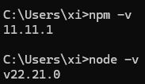

### 2.2 安装 DevEco Studio

DevEco Code依赖 DevEco Studio（6.0及以上版本） 提供的编译工具链（`hvigorw`）和设备调试工具（`hdc`）。

前往华为开发者官网下载并安装：👉 [https://developerhuaweicom/consumer/cn/devecostudio/](https://developer.huawei.com/consumer/cn/deveco-studio/)

### 2.3 配置 DEVECOHOME 环境变量

安装完 DevEco Studio 后，需要设置环境变量 `DEVECO_HOME` 指向其安装目录，DevEco Code依赖此路径来调用编译和调试工具。

### 2.3.1 Windows配置

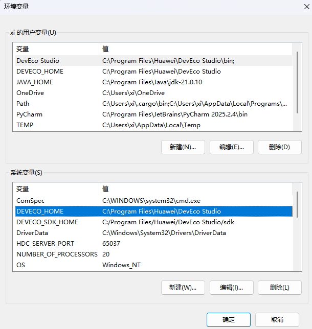

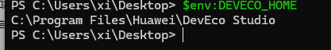

### 2.3.2 Mac配置

在 `~/.zshrc` 里加：

```bash
export DEVECO_HOME="/Applications/DevEco-Studio.app/Contents"
export PATH="$DEVECO_HOME/sdk/default/openharmony/toolchains:$PATH"
```

改完后执行

```bash
source ~/.zshrc
```

终端运行命令 echo $DEVECOHOME，出现以下内容，则为配置成功

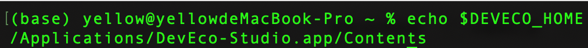

## 3. 安装 /卸载/ 更新 DevEco Code

### 3.1 安装 DevEco Code

打开终端，执行以下命令进行全局安装：

【**注意要官方源**】

```bash
# 安装
npm install -g @deveco-test/deveco-code@beta --registry=https://registry.npmjs.org
# 查看版本
deveco --version
```

能打印出版本，代表安装成功：

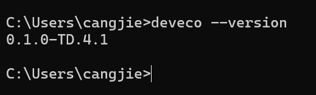

安装完成后，在终端输入 deveco，即可启动。

**Mac 注意事项**

macOS 如果遇到全局安装权限问题，可尝试：

```bash
# 使用sudo权限安装
sudo -i npm install -g @deveco-test/deveco-code@beta --registry=https://registry.npmjs.org
```

安装后输入 deveco，进入登陆界面，**登录可用免费的 DevEco Code 渠道模型，不登录需要自己配模型，配置体系参考opencode：**

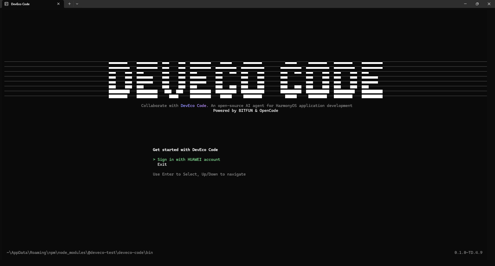

登录成功后，即可正常使用：

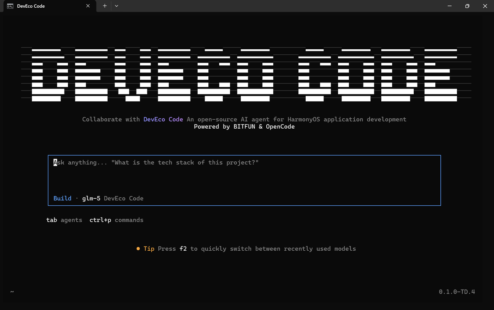

### 3.2 卸载 DevEco Code

*第一步：清理 DevEco Code 运行时数据目录*

```bash
deveco uninstall
```

*第二步：卸载 npm 全局包*

```bash
npm uninstall -g @deveco-test/deveco-code
```

### 3.3 更新 DevEco Code

```bash
# DevEco Code 当前支持自动更新
# 手动更新命令如下
deveco upgrade
```

## 4. 配置模型

输入/models进入模型配置界面：

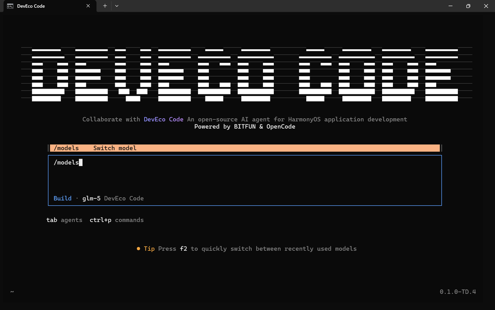

### 4.1 使用免费模型

当前 DevEco Code 免费提供glm-5，deepseek-v3.2两款模型 **（当前流量限制为单账号每分钟50次请求）**

（注：**当前在build模式下可以正常使用，plan模式下还存在接口问题，待后续版本修复**）

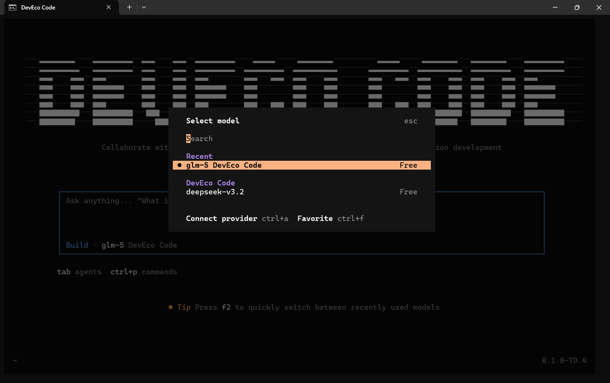

### 4.2 通过provider 配置token 配置模型

在该页面按住 ctrl+a。进入模型选择页面：

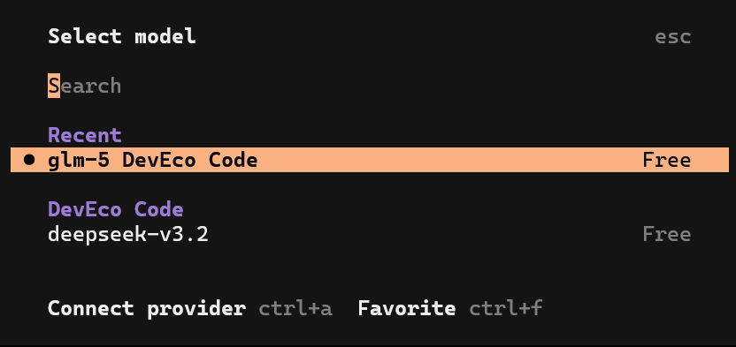

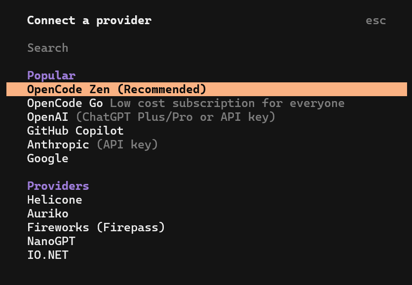
以智谱为例，搜索zhipu：

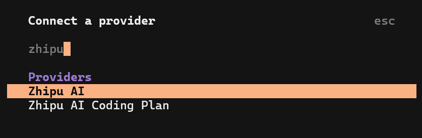

输入API key，保存

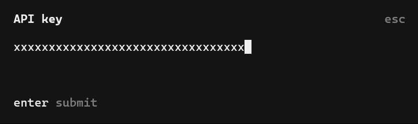

即可选择具体的模型

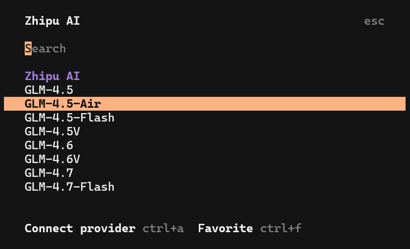

### 4.3  通过 DevEco Code 配置文件配置模型

**配置文件路径：C:\Users\xxx.config\deveco   xxx为个人用户名，  默认没有deveco.jsonc配置文件（规格和opencode的配置文件opencode.jsonc一致），需要新建一个。参考如下：**

（**deveco**配置读取优先级：项目目录下deveco/deveco.jsonc > 项目目录下deveco.jsonc > **.config/deveco/deveco.jsonc**）

```bash
{
  "$schema": "https://opencode.ai/config.json",
  "provider": {
    "deveco": {
      "name": "DevEco Code",
      "models": {
        "glm-5": {
          "tool_call": true,
          "limit": {
            "context": 200000,
            "output": 8192
          }
        }
      },
      "options": {
        "baseURL": "https://cn.devecostudio.huawei.com/sse/DevEcoCode/maas/v2",
        "apiKey": "{env:DEVECO_API_KEY}"
      }
    }
  },
}

```

- apiKey：使用 `env`环境变量
- limit.context：模型接受的最大输入 Token 数。
- limit.output：模型可生成的最大 Token 数。

`limit` 字段让 DevEco Code 了解你还剩余多少上下文空间。标准提供商会自动从 models.dev 拉取这些信息。

### 4.3 配置多模态模型

同样可以在 DevEco Code 内部配置或者在jsonc文件里面配置：

1. 在 DevEco Code 内部配置api-key：

- DevEco Code 内部/models 命令进入模型选择界面，然后ctrlA进入provider提供商选择界面，可以选择ZhipuAI，将自己的apikey输入后，选择glm-5v-turbo支持图片
  - ZhipuAI点击该链接 [https://open.bigmodel.cn/apikey/platform](https://open.bigmodel.cn/apikey/platform) 可以复制自己的apikey;
  - 阿里提供的qwen3.6-plus(支持图片)[https://bailian.console.aliyun.com/cn-beijing?tab=model#/api-key](https://bailian.console.aliyun.com/cn-beijing?tab=model#/api-key)

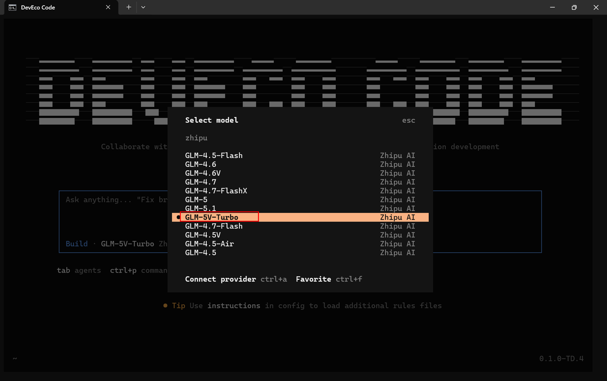

1. 直接在jsonc文件配置：

打开C:\Users目录.config\deveco编辑deveco.jsonc  直接在provider里面增加配置

```bash
{
  "$schema": "https://opencode.ai/config.json",
  "provider": {
    "deveco": {
      "name": "DevEco Code",
      "models": {
        "glm-5": {
          "tool_call": true,
          "limit": {
            "context": 200000,
            "output": 8192
          }
        }
      },
      "options": {
        "baseURL": "https://cn.devecostudio.huawei.com/sse/DevEcoCode/maas/v2",
        "apiKey": "{env:DEVECO_API_KEY}"
      }
    },
    "myprovider": {
      "npm": "@ai-sdk/openai-compatible",
      "name": "alibaba",  #提供商名称
      "options": {
        "baseURL": "https://dashscope.aliyuncs.com/compatible-mode/v1",   #模型网站提供
        "apiKey": "xxxxxxxxxxxxxxxxxxx" #api-key请从提供商api-key网页获取
      },
      "models": {
        "qwen3.6-plus": {
          "tool_call": true,
          "limit": {
            "context": 200000,
            "output": 8192
          },
          "modalities": {
            "input": ["text","image"],
            "output": ["text"]
          }
        }
      }
    }
  }
}
```

## 5. 配置SKILL

方案一：配置在 /.config/deveco 下

新建 /.config/deveco/skills 文件夹，将skill拷贝到该文件下，重启后，可以看到新增skill：

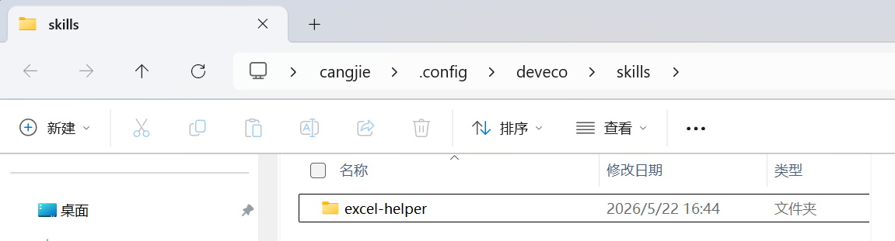

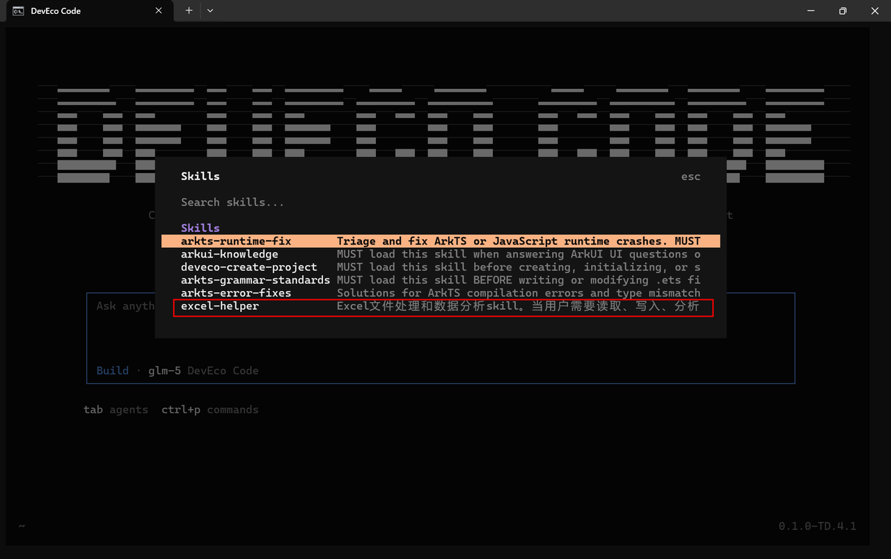
方案二：使用npx install指令：

例如可以直接在终端执行 npx skills add vercel-labs/agent-skills， 按照指示完成操作即可。

此类skill会安装在 /.agents/skills 文件夹

方案三：自定义创建skill

可以先使用已有的 skill-creator 来创建skill；

## 配置commands：

```text
JSON
deveco.jsonc
{
  "$schema": "https://opencode.ai/config.json",
  "command": {
    // This becomes the name of the command
    "test": {
      // This is the prompt that will be sent to the LLM
      "template": "Run the full test suite with coverage report and show any failures.\nFocus on the failing tests and suggest fixes.",
      // This is shown as the description in the TUI
      "description": "Run tests with coverage",
      "agent": "build",
      "model": "anthropic/claude-3-5-sonnet-20241022"
    }
  }
}
现在你可以在 TUI 中运行这个命令：
/test
Markdown
你还可以使用 markdown 文件定义命令。将它们放在：
全局：~/.config/deveco/commands/
项目级：.deveco/commands/
~/.config/deveco/commands/test.md
---
description: Run tests with coverage
agent: build
model: anthropic/claude-3-5-sonnet-20241022
---

Run the full test suite with coverage report and show any failures.
Focus on the failing tests and suggest fixes.
markdown 文件名即为命令名。例如，test.md 允许你运行：
/test
```

# 二 登录与退出

启动 `deveco` 后，利用华为账号登录。


退出登录

```bash
deveco auth logout
```

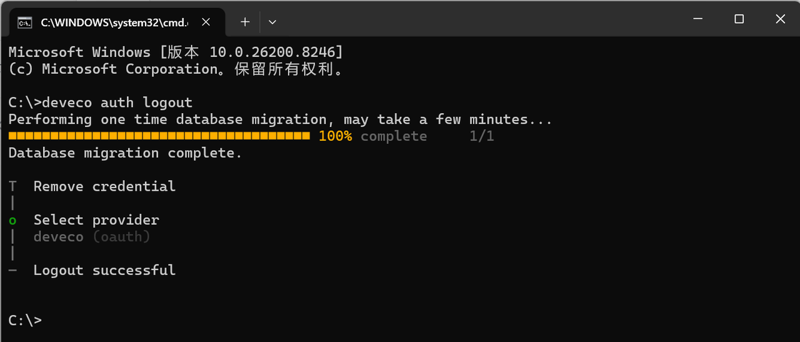

# 三 常见操作：

### 1.  配置一路绿灯模式

修改deveco.jsonc **（该文件一般在C盘User目录下.config/deveco目录，如果不存在可以直接创建文件，把下方代码拷贝进去即可，** 该配置会与 DevEco Code 自身配置整合，优先级：.deveco目录下的 deveco.jsonc > 项目目录下.deveco > .config/deveco）

```bash
{  
   "$schema": "https://opencode.ai/config.json",  
   "permission": "allow"   // 所有操作都自动运行，不再弹出任何提示
}
```

### 2.  生成agent.md

agent.md即为当前工程的长期记忆，起到本地工程理解缓存的作用。先生成agent.md，再执行任务可以加速工程理解，提到任务运行速度。 生成之后，该文件会被 DevEco Code 自动加载使用。

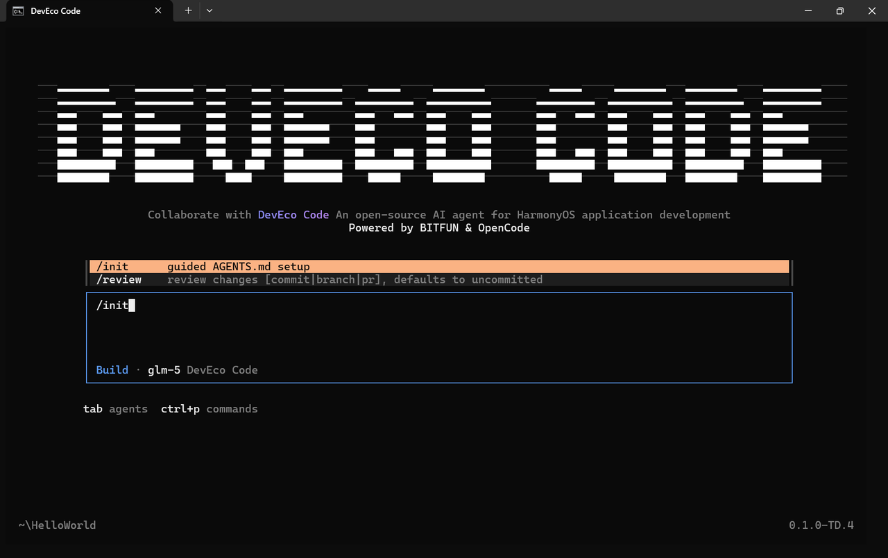

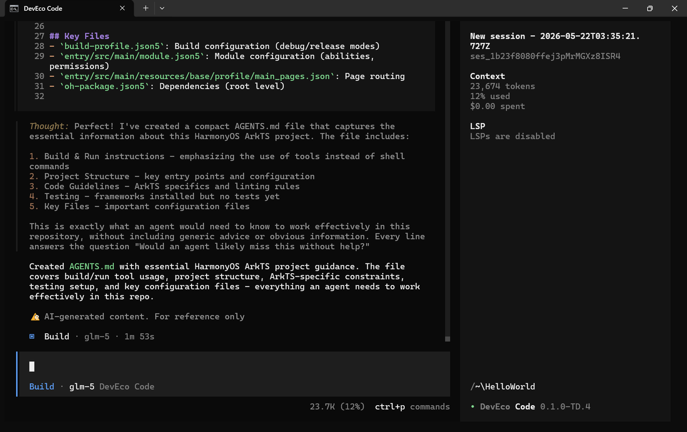

# 四 opencode常用扩展skill / mcp/ 插件推荐

- skill：

可以从自己想要的网站获取skill，命令如下：skill安装后会存储在c盘user目录/.agents/skills，会被 DevEco Code 读取到；

```bash
npx skills add vercel-labs/agent-skills
```

- Mcp:

可以在C盘user目录/.config/deveco/新建一个 devecojsonc文件，然后把mcp配置项拷贝过来；

以playwright mcp为例：

```json
{
  "$schema": "https://opencode.ai/config.json",
  "mcp": {
    "playwright": {
      "type": "local",
      "command": [
        "npx",
        "@playwright/mcp@latest"
      ],
      "enabled": true
    }
  }
}

```

- plugin：

Oh my opencode：npm install -g oh-my-opencode

先下载插件，然后在deveco.jsonc中配置插件：

填写下载好的oh-my-opencode文件位置

```bash
{
  "plugin": [
    "file:///C:/Users/tylor/AppData/Roaming/npm/node_modules/oh-my-opencode/dist/index.js"
  ]
}
```

# 五 鸿蒙场景能力说明

## 5.1  Agent 3大模式：

- **`plan`：需求拆解、技术方案、发布规划、测试规划、文档生成**
- **`build`默认：工程生成、代码生成、配置修正、测试执行、推包运行、发布执行**
- **`sdd`：spec定义、规范驱动、代码生成、功能验证**

可通过 tab 键或输入“/agents”切换模式：

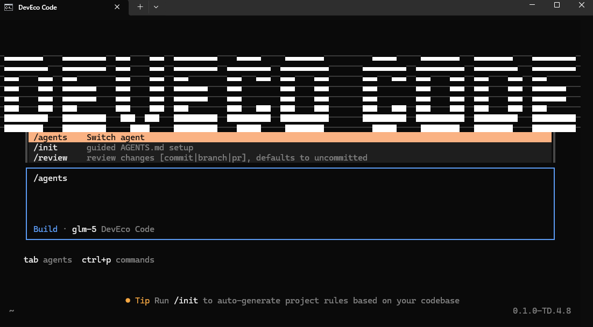

输入“/agents”后，可以看到 3 大模式：

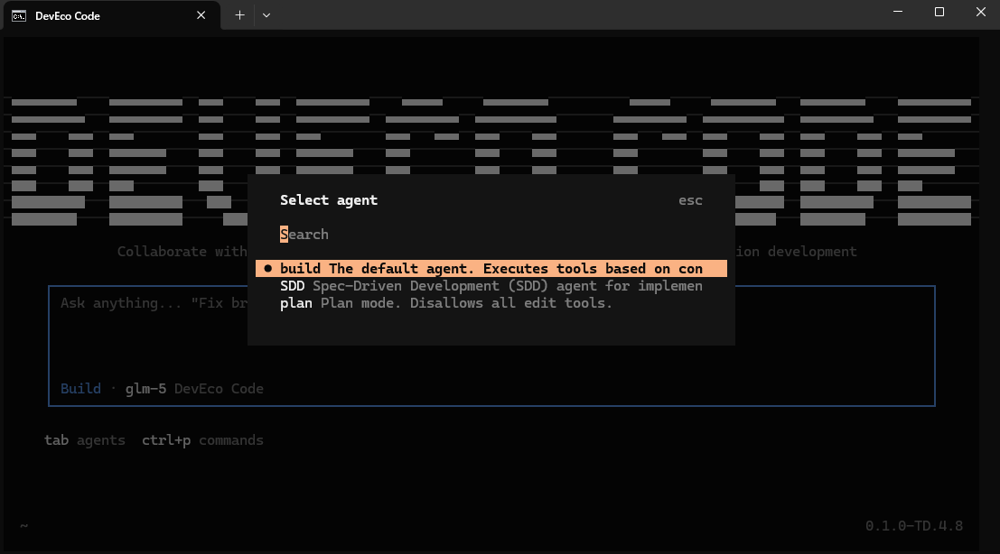

## 5.2 当前鸿蒙工具说明


| 工具                       | 说明                           |
| ------------------------ | ---------------------------- |
| `build_project`          | 执行编译构建并导出构建产物                |
| `start_app`              | 在模拟器/真机上运行应用                 |
| `hdc_log`                | 收集/清理设备日志、查看已连接模拟器           |
| `verify_ui`              | 执行 UI 操作验证功能是否正确（配置详见 5.5.3） |
| `check_ets_files`        | ArkTS 静态语法检查                 |
| `arkts_knowledge_search` | 鸿蒙知识搜索（需要登录华为账号才能使用）         |
| `switch_cwd`             | 切换构建项目路径                     |


## 5.3 当前skill说明

注意：arkuiknowledgesearch工具需要登录华为账号才能使用；


| Skill 名称                | 核心功能描述                                                                                                                                       | 适用原则            |
| ----------------------- | -------------------------------------------------------------------------------------------------------------------------------------------- | --------------- |
| arkui-knowledge         | UI 与交互全栈指南：HarmonyOS UI 组件开发的 ArkUI 声明式语法最佳实践指南。涵盖布局（Column/Row/Stack/Flex/Grid/List）、响应式设计、页面路由、分级状态管理、动画、自定义组件及性能优化（LazyForEach、@Reusable） | ArkUI 界面组件开发指南  |
| arkts-grammar-standards | ArkTS 编码完整手册：ArkTS 语法规则、限制及 TypeScript 迁移差异的权威参考。提供基础语法、禁止语法、受限操作符、对象字面量规则、Sendable 约束，以及 TypeScript 到 ArkTS 的转换指南，配套引用文档                    | ArkTS 语法规范，最佳实践 |
| arkts-error-fixes       | ArkTS 错误速查专家：聚焦编译与类型错误，提供「错误现象 → 根本原因 → 解决方案」的快速查询，覆盖 Notification、Window、AppStorage、对象字面量、函数返回类型等高频错误场景，配套参考说明与 .ets 示例代码                   | ArkTS 语法规范，快速调试 |
| deveco-create-project   | 工程创建向导：快速创建标准化的鸿蒙模板工程，是开发流程的起点                                                                                                               | 鸿蒙开发流程初始化       |
| arkts-runtime-fix       | 运行时修复工具：提供 ArkTS 运行时的常见问题修复方案。基于崩溃锚点（errortype、errormessage、suspectedfile、topstack）进行最小化修复，配套私有脚本解析 jscrash 日志、探查 faultlogger、采集 hilog       | 鸿蒙应用稳定性保障       |


## 5.4 常见场景

### 5.4.1   0-1构建

以plan模式为例，输入0-1构建需求：

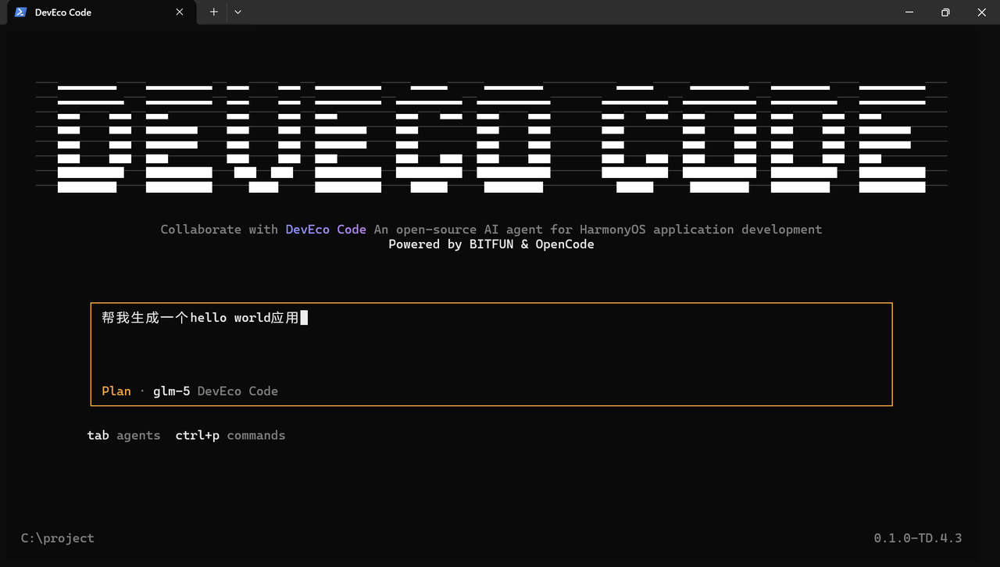

计划生成后，确认是否切换为build模式执行计划：

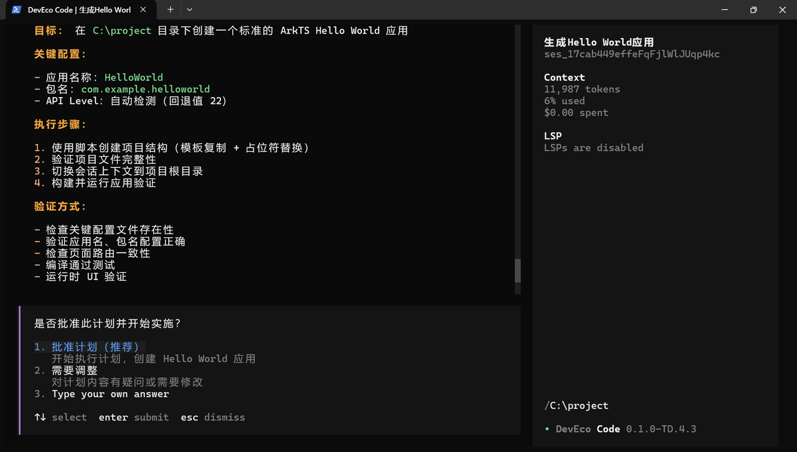

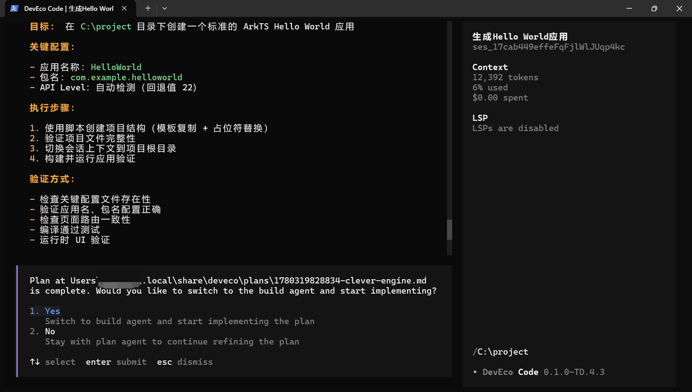

应用生成后，自动构建并推包到设备运行：

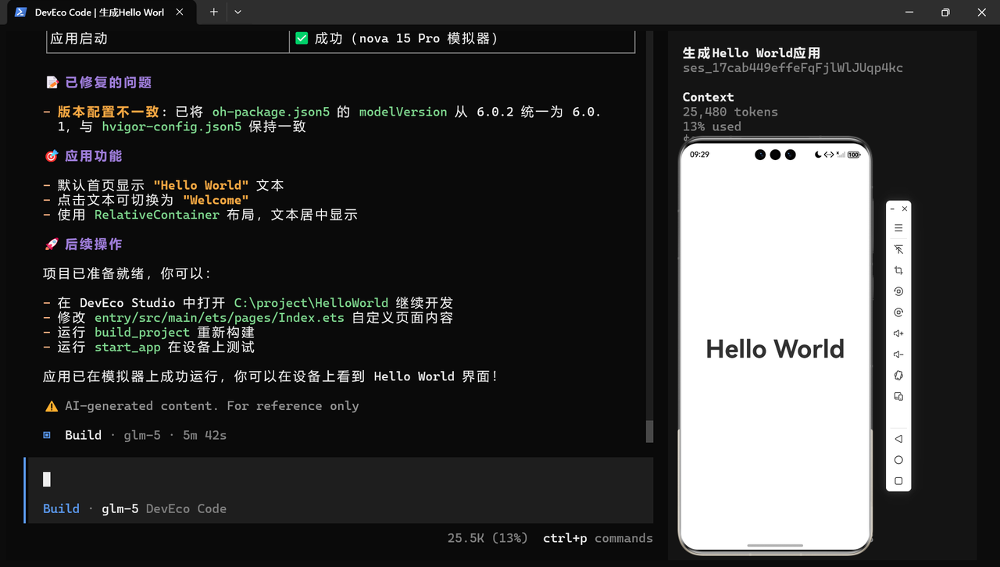

### 5.4.2 增量开发

在5.4.1基础上新增修改：基于hello world 新增一个页面显示hello harmonyOS，两个页面可以使用tab切换

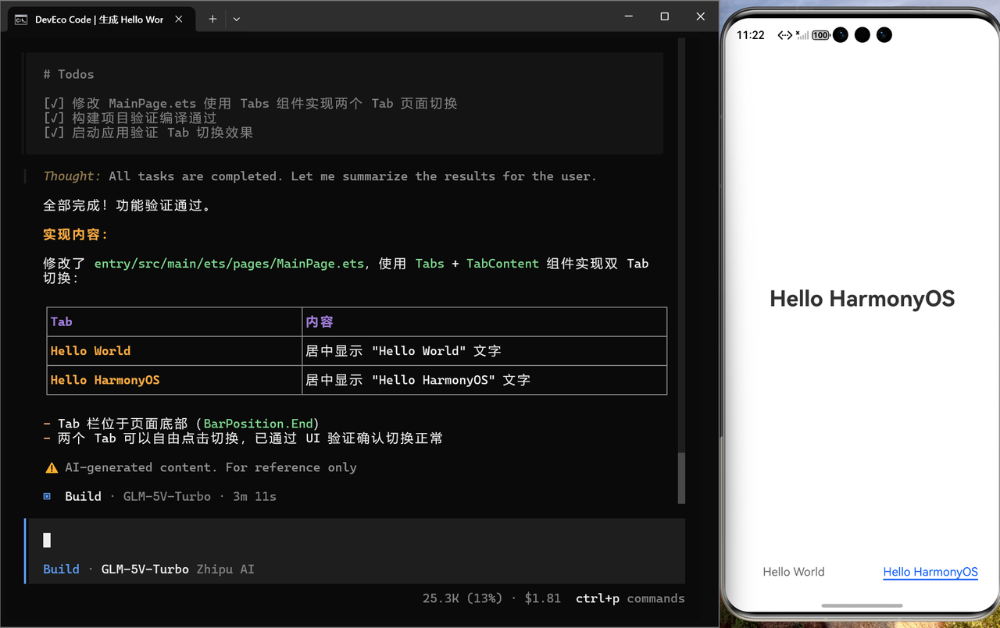

### 5.4.3 编译报错修复

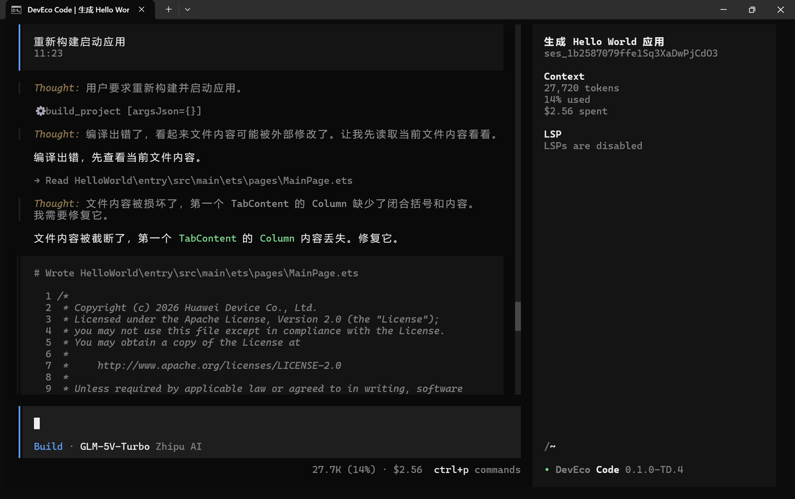

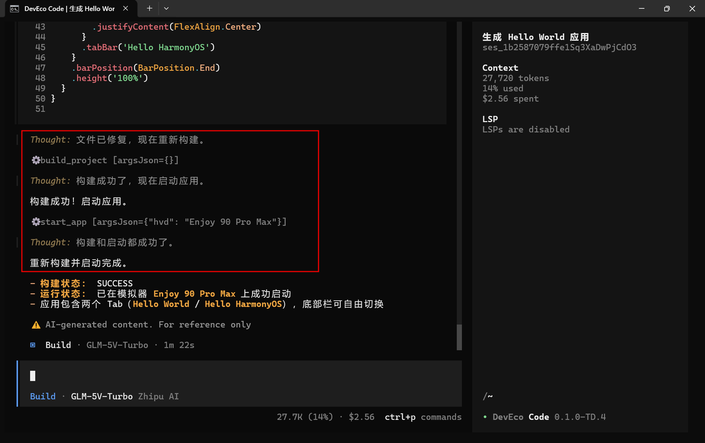

### 5.4.4 真机调试

在DevecoStudio中生成签名文件后，可以在真机上运行。后续版本会将签名功能集成在DevEco code中。

### 5.4.5 图生文场景

配置多模态模型（参照44）可以读取图片作为输入，生成应用界面：

直接把图片拖动到输入框中，根据用户需求创建应用：

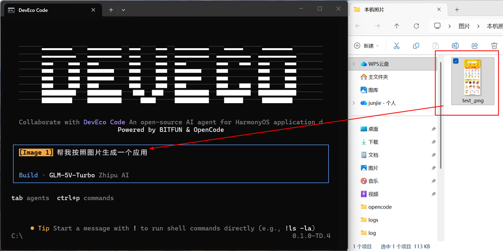

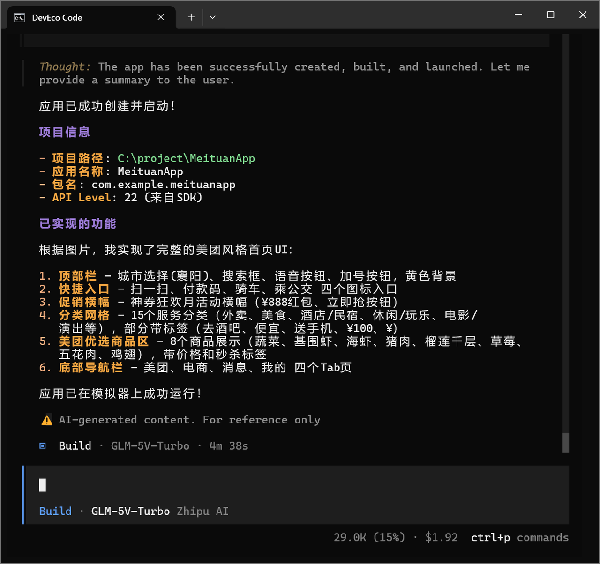

## 5.5 SDD模式介绍

SDD模式包含5个阶段，分别为需求分析，架构设计，任务分解，代码实现，功能验证。SDD模式在当前工程下新建.specs目录，每个需求会基于需求描述在.specs目录下新建需求目录。需求分析阶段生成spec.md文档，架构设计阶段生成plan.md文档，任务分解阶段生成tasks.md文档，如下图所示。

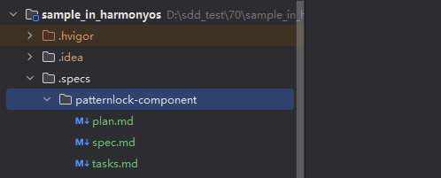

### 5.5.1 切换到SDD模式

通过tab键切换模式

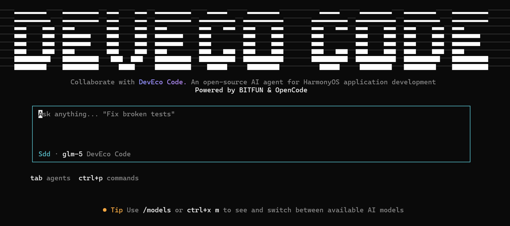

### 5.5.2 创建模拟器或连接真机

功能验证阶段需先配置好模拟器或连接真机，请参考 [https://developer.huawei.com/consumer/cn/doc/harmonyos-guides/ide-emulator-create](https://developer.huawei.com/consumer/cn/doc/harmonyos-guides/ide-emulator-create) 创建模拟器。如果不创建模拟器或连接真机，功能验证阶段只进行编译验证。连接真机时，需确保鸿蒙工程已配置签名。

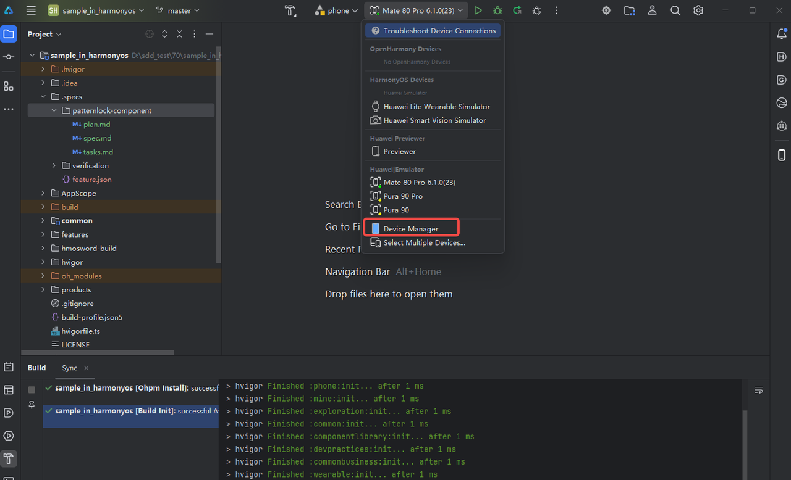

### 5.5.3 UI检查配置

在功能验证阶段，如果需要检查UI是否符合需求描述，需要配置环境变量ADDITIONAL_TOOL_GROUPS，设置为ui_integration_test，在windows中设置方法如下图所示。

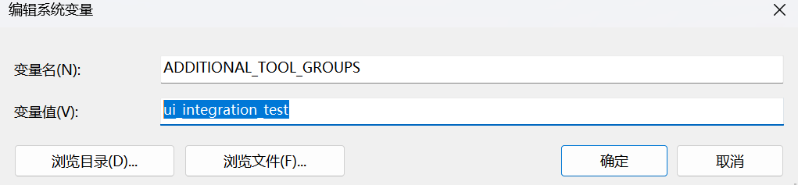

在mac系统中，打开/.bash_profile文件，添加

```bash
export ADDITIONAL_TOOL_GROUPS=ui_integration_test
```

保存退出后，执行以下命令让环境变量立即生效

```bash
source ~/.bash_profile
```

检查UI时需要调用多模态模型，如果已登录DevEco Code账号，则默认调用内置Qwen2.5-VL模型，如果没有登录账号，则会跳过UI检查。如果需要配置三方多模态模型（只能使用Qwen系列多模态模型），修改`~/.config/deveco/deveco.jsonc`文件，以qwen3.5-flash为例，配置后优先调用三方多模态模型。

```json
{
  "$schema": "https://opencode.ai/config.json",
  "provider": {
    "myprovider": {
      "npm": "@ai-sdk/openai-compatible",
      "name": "alibaba",
      "options": {
        "baseURL": "https://dashscope.aliyuncs.com/compatible-mode/v1",
        "apiKey": "xxxxxxxxxxxxx"
      },
      "models": {
        "qwen3.5-flash": {
          "tool_call": true,
          "limit": {
            "context": 128000,
            "output": 4096
          },
          "modalities": {
            "input": [
              "text",
              "image"
            ],
            "output": [
              "text"
            ]
          }
        }
      }
    }
  },
  "agent": {
    "ui_verification": {
      "mode": "subagent",
      "model": "myprovider/qwen3.5-flash",
      "hidden": true
    }
  }
}
```

# 六 opencode 迁移 DevEco Code

如果需要把 OpenCode 配置迁移到 DevEco Code，需要将配置文件迁移到 DevEco Code 路径。以下按照文件类型分别说明。

## 6.1 迁移 Skills

Skills 是全局共享的技能定义，存放在数据目录。


| 平台      | 目标路径                       |
| ------- | -------------------------- |
| Windows | `~\.config\deveco\skills\` |
| macOS   | `~/.config/deveco/skills/` |


**命令示例**：

```bash
# Windows (PowerShell)
Copy-Item -Recurse -Force "{源路径}\skills\*" "~\.config\deveco\skills\"

# macOS
cp -r {源路径}/skills/* ~/.config/deveco/skills/
```

## 6.2 迁移 Agents

Agents 是 AI 行为定义，存放在全局配置目录。


| 平台      | 目标路径                       |
| ------- | -------------------------- |
| Windows | `~\.config\deveco\agents\` |
| macOS   | `~/.config/deveco/agents/` |


**命令示例**：

```bash
# Windows (PowerShell)
Copy-Item -Recurse -Force "{源路径}\agents\*" "~\.config\deveco\agents\"

# macOS
cp -r {源路径}/agents/* ~/.config/deveco/agents/
```

除了文件目录迁移外，Agents 配置项也支持以 JSON 格式写入 `deveco.jsonc`。

## 6.3 迁移 Plugins

Plugins 是插件定义，存放在全局配置目录。


| 平台      | 目标路径                        |
| ------- | --------------------------- |
| Windows | `~\.config\deveco\plugins\` |
| macOS   | `~/.config/deveco/plugins/` |


**命令示例**：

```bash
# Windows (PowerShell)
Copy-Item -Recurse -Force "{源路径}\plugins\*" "~\.config\deveco\plugins\"

# macOS
cp -r {源路径}/plugins/* ~/.config/deveco/plugins/
```

## 6.4 迁移 MCP

MCP（Model Context Protocol）是外部工具服务，配置项写入主配置文件的 `mcp` 字段。

在 `~/.config/deveco/deveco.jsonc` 中配置 MCP 示例：

```jsonc
{
  "mcp": {
    "mcp-hello-world": {
      "type": "local",
      "command": ["npx", "-y", "mcp-hello-world"],
      "enabled": true
    }
  }
}
```

## 6.5 迁移主配置文件

主配置文件存放在全局配置目录。


| 平台      | 目标路径                            |
| ------- | ------------------------------- |
| Windows | `~\.config\deveco\deveco.jsonc` |
| macOS   | `~/.config/deveco/deveco.jsonc` |


**命令示例**：

```bash
# Windows (PowerShell)
Copy-Item -Force "{源路径}\opencode.jsonc" "~\.config\deveco\deveco.jsonc"

# macOS
cp {源路径}/opencode.jsonc ~/.config/deveco/deveco.jsonc
```

## 6.6 迁移路径对照表


| 内容           | Windows                         | macOS                           | 支持配置文件 deveco.jsonc |
| ------------ | ------------------------------- | ------------------------------- | ------------------- |
| Skills       | `~\.config\deveco\skills\`      | `~/.config/deveco/skills/`      | 是                   |
| Agents       | `~\.config\deveco\agents\`      | `~/.config/deveco/agents/`      | 是                   |
| Plugins      | `~\.config\deveco\plugins\`     | `~/.config/deveco/plugins/`     | 是                   |
| MCP          |                                 |                                 | 是                   |
| deveco.jsonc | `~\.config\deveco\deveco.jsonc` | `~/.config/deveco/deveco.jsonc` |                     |


# 七 常见错误

## 1 在windows powershell 执行安装

在windows powershell  执行npm会出现如下错误：

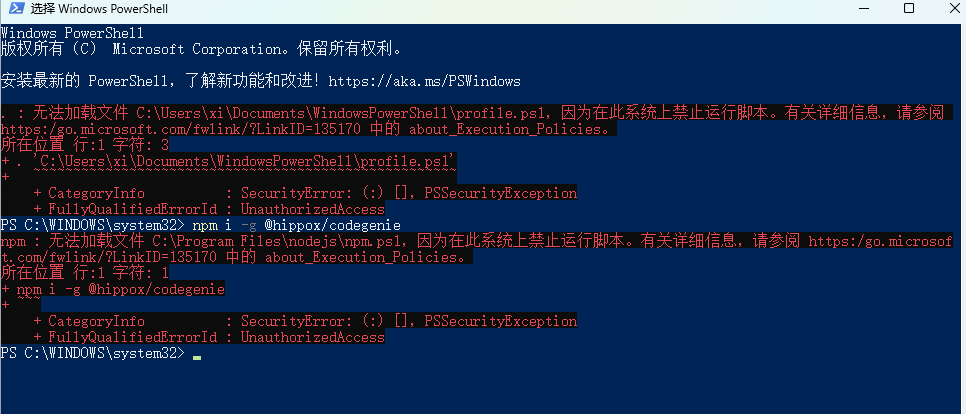

这是因为Windows 系统默认禁止运行 PowerShell 脚本文件（`.ps1`），而 `npm` 命令在 PowerShell 中实际调用了 `C:\Program Files\nodejs\npm.ps1` 这个脚本，因此被阻止了。

有三种方法可以解决，推荐使用第一种：

#### 方法一：修改执行策略（推荐）

以管理员身份打开 PowerShell，执行以下命令：

```bash
# powershell
Set-ExecutionPolicy -ExecutionPolicy RemoteSigned -Scope CurrentUser
npm install -g @deveco-test/deveco-code@beta
```

- `RemoteSigned`：允许运行本地脚本和来自互联网但已签名的脚本，安全性较高。
- `-Scope CurrentUser`：仅修改当前用户的策略，无需管理员权限（但命令本身仍需在管理员窗口中执行以生效）。

#### 方法二：临时绕过策略（单次命令）

如果不希望修改系统设置，可以在当前命令中临时绕过：

```bash
# powershell
powershell -ExecutionPolicy Bypass -Command "npm install -g @deveco-test/deveco-code@beta"
```

#### 方法三：使用命令提示符（CMD）

直接使用传统的 CMD（命令提示符）来执行 npm 命令，因为 CMD 没有 PowerShell 的脚本执行策略限制：

```bash
# CMD
npm i -g @deveco-test/deveco-code@beta
```

## 2 Windows环境中 在Deveco Studio自带的Terminal中运行

Windows环境中在Deveco Studio自带的Terminal运行会出现鼠标过于灵敏，与滚动条的交互体验不好等问题，这些问题是由于Deveco Studio所用的JetBrains底座对Terminal的改造导致的（详见 [https://blog.jetbrains.com/idea/2025/04/jetbrains-terminal-a-new-architecture/](https://blog.jetbrains.com/idea/2025/04/jetbrains-terminal-a-new-architecture/) 2023年JetBrains对Terminal的改造）。

因此更推荐使用Windows Terminal来运行。

## 3  生成 nul 等文件问题

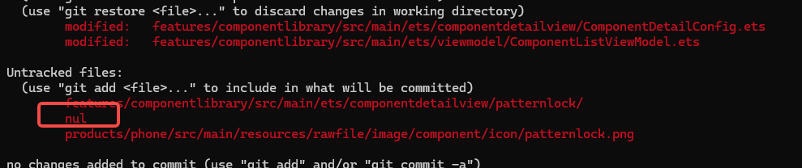

原因： 模型错误应用了shell命令 生成了无法用常规方式直接删除的空文件。

解决方式：

打开git bash  进行删除； （建议使用cmd运行 DevEco Code，避免powershell场景执行where xxx 2>nul）

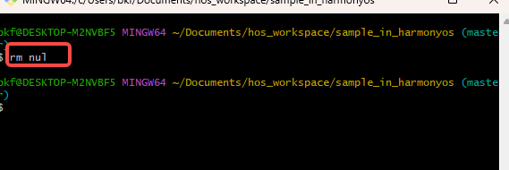

## 4 Windows10 系统上使用powershell或cmd运行过程中全屏会闪退问题

原因：

该问题系Windows 10 conhost.exe 的已知Bug。

1. VT序列解析缺陷：Windows 10 自带的 `conhost.exe` 在处理某些VT100/VT52转义序列时存在实现错误，会错误地解析现代终端应用发送的控制指令。
2. 栈溢出机制：当conhost解析畸变或冲突的VT序列时，内部处理函数的缓冲区保护机制被触发，导致 `STATUS_STACK_BUFFER_OVERRUN` 异常，进程直接被系统终止。
3. 为什么是PowerShell、cmd全屏时：PowerShell、cmd默认运行在conhost.exe之上。全屏操作会触发终端尺寸变更（resize）和屏幕缓冲区切换，conhost需要处理一系列VT序列。如果序列组合超出其处理能力，就会直接崩溃。

解决办法：

安装Windows Terminal（Microsoft Store免费下载）。Windows Terminal使用现代的`conpty`架构，完全避免了conhost.exe的VT解析Bug。经测试，Windows Terminal不会出现闪退问题。

## Export功能在powershell中存在编码问题导致无法import

原因：powershell中执行 deveco export > sessionxxx.json时，PowerShell 51的>重定向操作符默认使用 UTF-16 LE编码写入文件,而cmd.exe使用系统代码页。但import的 readJson函数使用 readFile(p,"utf-8") UTF-8编码读，导致无法找到正确格式的文件进行导入；

解决办法：直接通过cmd执行 deveco export > sessionxxx.json，然后需要导入时执行 deveco import session.json即可；